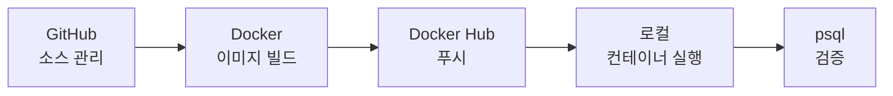

# 🐘 Docker PostgreSQL

> GitHub 소스 관리부터 Docker Hub 배포, 로컬 PostgreSQL 구동·검증까지 — 개발 초기 환경을 한 번에 세팅하는 가이드입니다.

[](https://www.postgresql.org/)
[](https://docs.docker.com/compose/)
[](LICENSE)

---

## 목차

- [개요](#개요)
- [빠른 시작](#빠른-시작)
- [프로젝트 구조](#프로젝트-구조)
- [데이터베이스 초기화](#데이터베이스-초기화)
- [Docker 설정 파일](#docker-설정-파일)
- [CLI 명령어 요약](#cli-명령어-요약)
- [연결 정보](#연결-정보)
- [핵심 개념 및 주의점](#핵심-개념-및-주의점)

---

## 개요

이 저장소는 **회원 테이블**과 **스토어드 프로시저(SP)** 가 포함된 PostgreSQL 개발 환경을 Docker로 구성합니다.



| 단계 | 설명 |
|------|------|
| 1️⃣ GitHub | 소스 코드 버전 관리 및 원격 저장소 푸시 |
| 2️⃣ Docker Hub | 커스텀 이미지 빌드 및 배포 |
| 3️⃣ 로컬 실행 | 컨테이너 구동 후 DB·SP 동작 확인 |

---

## 빠른 시작

로컬에서 바로 DB를 띄우려면 아래 명령어만 실행하면 됩니다.

```bash
# 1. 컨테이너 백그라운드 실행
docker compose up -d

# 2. psql 접속
docker exec -it my_postgres_db psql -U myuser -d mydb

# 3. 데이터 확인 (psql 내부)
SELECT * FROM users;
```

> **Tip:** `docker compose`는 프로젝트 루트의 `docker-compose.yml`을 사용합니다. Hub에서 받은 커스텀 이미지로 실행하려면 [4-3. Docker 컨테이너 구동](#4-3-docker-컨테이너-구동-로컬-실행)을 참고하세요.

---

## 프로젝트 구조

```
docker_postgresql/
├── init/
│   └── 01_init.sql       # 테이블 및 SP 초기화 스크립트
├── Dockerfile            # Docker Hub 빌드용 정의 파일
├── docker-compose.yml    # 로컬 컨테이너 구동용 정의 파일
└── README.md
```

---

## 데이터베이스 초기화

PostgreSQL 공식 Docker 이미지는 `/docker-entrypoint-initdb.d/` 폴더의 `.sql` 파일을 **컨테이너 최초 실행 시** 자동으로 실행합니다.

[`init/01_init.sql`](init/01_init.sql) 에는 다음이 포함됩니다.

| 구성 요소 | 설명 |
|-----------|------|
| `users` 테이블 | 회원 정보 (id, username, email, created_at) |
| `insert_user` SP | 새 회원을 추가하는 스토어드 프로시저 |
| 초기 데이터 | `docker_user` 테스트 계정 1건 |

```sql
-- 1. 테이블 생성
CREATE TABLE IF NOT EXISTS users (
    id SERIAL PRIMARY KEY,
    username VARCHAR(50) NOT NULL UNIQUE,
    email VARCHAR(100) NOT NULL,
    created_at TIMESTAMP DEFAULT CURRENT_TIMESTAMP
);

-- 2. 스토어드 프로시저(SP) 생성
CREATE OR REPLACE PROCEDURE insert_user(
    p_username VARCHAR,
    p_email VARCHAR
)
LANGUAGE plpgsql
AS $$
BEGIN
    INSERT INTO users (username, email)
    VALUES (p_username, p_email);
END;
$$;

-- 3. 초기 테스트 데이터 삽입
CALL insert_user('docker_user', 'docker@example.com');
```

---

## Docker 설정 파일

### docker-compose.yml

매번 긴 Docker 명령어를 입력하지 않도록 정의 파일을 사용합니다. 초기화 스크립트 마운트와 데이터 영속성 볼륨이 연결되어 있습니다.

```yaml
version: '3.8'

services:
  db:
    image: postgres:15-alpine
    container_name: my_postgres_db
    restart: always
    environment:
      POSTGRES_USER: myuser
      POSTGRES_PASSWORD: mypassword
      POSTGRES_DB: mydb
    ports:
      - "5432:5432"
    volumes:
      # 초기화 스크립트 볼륨 매핑
      - ./init:/docker-entrypoint-initdb.d
      # 데이터 영속성을 위한 저장 공간 지정
      - pgdata:/var/lib/postgresql/data

volumes:
  pgdata:
```

### Dockerfile

초기 SQL 스크립트가 포함된 **커스텀 이미지**를 Docker Hub에 배포할 때 사용합니다.

```dockerfile
FROM postgres:15-alpine
# 초기화 스크립트를 이미지 내부의 자동 실행 경로로 복사
COPY ./init/01_init.sql /docker-entrypoint-initdb.d/
```

---

## CLI 명령어 요약

### 4-1. GitHub 소스 코드 관리 및 커밋

로컬 프로젝트 폴더를 Git 저장소로 초기화하고 원격 저장소에 푸시합니다.

```bash
# 현재 폴더를 Git 저장소로 초기화
git init

# 변경된 모든 파일 추가
git add .

# 첫 번째 커밋 메시지 작성
git commit -m "feat: 초기 PostgreSQL 도커 환경 및 SP 추가"

# 기본 브랜치 이름을 main으로 변경
git branch -M main

# 원격 GitHub 저장소 연결
git remote add origin https://github.com/SangminShimGit/docker_postgresql.git

# GitHub 원격 저장소로 푸시
git push -u origin main
```

### 4-2. Docker Hub 로그인 및 이미지 빌드/푸시

Docker Hub ID(`charlieshim`)로 인증 후 이미지를 생성하고 업로드합니다. Hub에서 레포지토리를 미리 만들지 않아도, `ID/이미지명` 형식으로 푸시하면 자동 생성됩니다.

```bash
# 1. Docker Hub 로그인 (Username과 Password 입력)
docker login

# 2. 이미지 빌드 (맨 끝의 점 '.' 필수)
docker build -t charlieshim/my-postgres-db:1.0 .

# 3. Docker Hub로 이미지 푸시
docker push charlieshim/my-postgres-db:1.0
```

> **💡 로그인 오류 (Access Denied) 발생 시**
>
> 2FA 등으로 로그인이 막히면, [Docker Hub → Account Settings → Security](https://hub.docker.com/settings/security)에서 발급한 **Access Token**을 비밀번호 칸에 입력하세요.
>
> ```bash
> docker login -u charlieshim
> ```

### 4-3. Docker 컨테이너 구동 (로컬 실행)

Docker Hub에 업로드한 커스텀 이미지로 로컬 컨테이너를 실행합니다.

<details>
<summary><strong>Linux / macOS / Git Bash</strong> (백슬래시 <code>\</code> 사용)</summary>

```bash
docker run -d \
  --name my_local_db \
  -p 5432:5432 \
  -e POSTGRES_USER=myuser \
  -e POSTGRES_PASSWORD=mypassword \
  -e POSTGRES_DB=mydb \
  charlieshim/my-postgres-db:1.0
```

</details>

<details>
<summary><strong>Windows PowerShell</strong> (백틱 <code>`</code> 사용)</summary>

```powershell
docker run -d `
  --name my_local_db `
  -p 5432:5432 `
  -e POSTGRES_USER=myuser `
  -e POSTGRES_PASSWORD=mypassword `
  -e POSTGRES_DB=mydb `
  charlieshim/my-postgres-db:1.0
```

</details>

<details>
<summary><strong>한 줄 실행</strong> (줄바꿈 기호 없음)</summary>

```bash
docker run -d --name my_local_db -p 5432:5432 -e POSTGRES_USER=myuser -e POSTGRES_PASSWORD=mypassword -e POSTGRES_DB=mydb charlieshim/my-postgres-db:1.0
```

</details>

### 4-4. 데이터베이스 및 SP 검증

컨테이너 내부 `psql`에 접속하여 스크립트가 정상 반영되었는지 확인합니다.

```bash
# 1. psql 접속
docker exec -it my_local_db psql -U myuser -d mydb
```

접속 후 아래 쿼리를 순서대로 실행합니다.

```sql
-- 2. 초기 데이터 확인
SELECT * FROM users;

-- 3. SP로 새 유저 추가
CALL insert_user('new_github_user', 'git@example.com');

-- 4. 반영 결과 재확인
SELECT * FROM users;
```

```bash
# 5. psql 종료
\q
```

---

## 연결 정보

| 항목 | 값 |
|------|-----|
| Host | `localhost` |
| Port | `5432` |
| Database | `mydb` |
| User | `myuser` |
| Password | `mypassword` |
| Container (compose) | `my_postgres_db` |
| Container (run) | `my_local_db` |

**JDBC URL 예시**

```
jdbc:postgresql://localhost:5432/mydb
```

---

## 핵심 개념 및 주의점

### 📦 데이터 영속성 — Volume 원리

Docker 컨테이너는 기본적으로 **일회성** 구조입니다. 컨테이너를 삭제하면 내부 데이터도 함께 사라집니다.

`docker-compose.yml`의 `pgdata:/var/lib/postgresql/data` 볼륨 옵션은 컨테이너 내부 데이터 폴더를 **로컬 독립 저장 공간**에 동기화하여 데이터를 보존합니다.

> ⚠️ **주의:** 초기화 SQL 스크립트는 **데이터 볼륨이 비어 있을 때(최초 구동 시)** 만 실행됩니다. 기존 볼륨이 남아 있으면 스크립트는 건너뛰고 기존 데이터가 사용됩니다.
>
> 초기화 스크립트를 다시 적용하려면 볼륨을 삭제한 뒤 재시작하세요.
>
> ```bash
> docker compose down -v
> docker compose up -d
> ```

### 🏠 Local DB vs 원격 Dev DB

| 구분 | Local DB (현재) | 원격 Dev DB |
|------|-----------------|-------------|
| 위치 | 내 PC (`localhost`) | 클라우드 (AWS EC2, RDS 등) |
| 목적 | 개인 샌드박스·빠른 테스트 | 팀 공유 개발 환경 |
| 보안 | 기본 설정 | 강력한 비밀번호, IP 화이트리스트, Security Group 등 필수 |

현재 세팅은 **로컬 전용**입니다. 팀과 공유하는 원격 개발 DB로 확장하려면 클라우드 인프라로 마이그레이션하고 접근 제어·암호 정책을 추가해야 합니다.

---

## License

MIT License — 자유롭게 사용·수정·배포할 수 있습니다.
